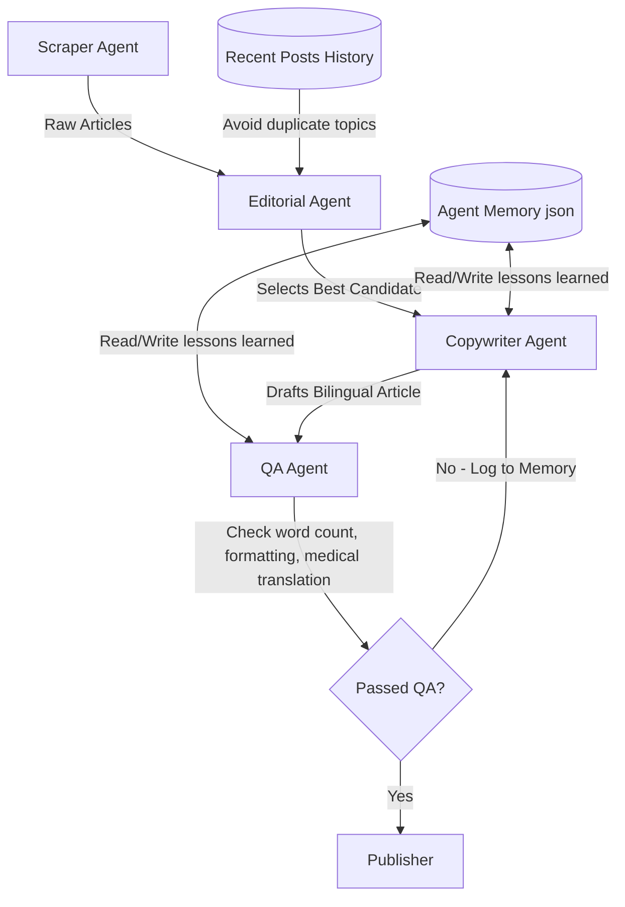

# 🦷 Dental Blog Bot

An automated tool that scrapes dental journals and uses AI to generate patient-friendly, bilingual blog posts for your website.

## 📂 Project Structure

- `main.py`: The entry point. Orchestrates the pipeline execution.
- `scraper.py`: Helper functions for parsing RSS feeds, cleaning article content, and scraping article images.
- `generator.py`: Coordinates the multi-agent system execution and the QA feedback loop.
- `publisher.py`: Handles formatting, local backups, and database merging to update the production website's posts list.
- `agents/`: Directory containing the multi-agent system components:
  - `base.py`: Declares `BaseAgent`, encapsulating Gemini client access, retry logic, and fallback models.
  - `scraper_agent.py`: `ScraperAgent` manages raw feed discovery and content sanitization.
  - `editorial_agent.py`: `EditorialAgent` deduplicates incoming news, scores/classifies articles, filters based on recent publication history, and selects the best candidate.
  - `copywriter_agent.py`: `CopywriterAgent` drafts bilingual posts in English and Greek sequentially, and processes QA feedback for revisions.
  - `qa_agent.py`: `QAAgent` validates generated content against strict style and word-count guidelines programmatically and performs LLM-assisted checks on Greek clinical terminology.
  - `memory.py`: `AgentMemory` handles saving and loading past QA errors as persistent lessons.
  - `prompts.py`: Centralized store for copywriting prompts and guidelines.
- `.github/workflows/weekly_blog.yml`: GitHub Actions workflow for automated weekly execution.
- `output/`: Folder where a backup copy of every generated blog post and the `agent_memory.json` file are saved.

---

## 🤖 Multi-Agent Architecture

The bot is structured as a collaborative multi-agent system designed for maximum resilience, editorial precision, and clinical translation accuracy.



### 🧠 Agent Roles & Collaboration
1. **Scraper Agent (`ScraperAgent`)**: Triggers the news ingestion. Fetches dental journals, parses RSS feeds, downloads full articles, extracts images, and sanitizes input data.
2. **Editorial Agent (`EditorialAgent`)**: Acts as the "Editor-in-Chief". It:
   - Groups duplicate or highly similar news stories using Jaccard similarity on titles.
   - Evaluates and scores articles based on clinical relevance, scientific credibility, and educational value.
   - Classifies articles into specific categories (e.g., *Implantology*, *Periodontology*, *Digital Dentistry*).
   - Filters out promotional, low-quality, or US-centric (insurance/regulatory) topics.
   - Penalizes articles similar to recently published topics.
   - Selects the single best candidate from the top 3 highest-rated items.
3. **Copywriter Agent (`CopywriterAgent`)**: Sequential bilingual copywriting. It first drafts the English version, then translates/rewrites it into professional medical Greek. This two-stage separation prevents language bleeding and ensures a natural, native flow in both languages.
4. **Quality Assurance Agent (`QAAgent`)**: Enforces strict publishing standards.
   - **Programmatic checks**: Ensures presence of all required tags/markers, checks that titles are under 12 words and contain no markdown formatting, confirms word counts are strictly within the 300-500 word limit, and verifies the practice name is included.
   - **LLM-assisted checks**: Compares the English and Greek versions to ensure Greek medical terms are translated correctly (e.g., *osseointegration* -> *οστεοενσωμάτωση*, *peri-implantitis* -> *περιεμφυτευματίτιδα*, *shedding* -> *έκλυση* or *απελευθέρωση*) and that the phrasing reads naturally.
5. **Agent Memory (`AgentMemory`)**: Implements persistent learning. If a generated post fails the QA check, the specific errors/rules are saved to `output/agent_memory.json`. In subsequent iterations (or subsequent pipeline runs), these lessons are loaded and injected as rules into the agents' prompts, creating a self-correcting feedback loop that prevents regression.

---

## 🧠 The 10-Stage Pipeline

The bot executes the editorial process using a coordinated multi-agent workflow:

1.  **Fetching**: `ScraperAgent` parses high-authority feeds.
2.  **Extraction**: Pulls full article text and scans for relevant media.
3.  **Deduplication**: `EditorialAgent` groups and filters out redundant stories.
4.  **Scoring**: Articles are rated on clinical relevance, credibility, and patient value.
5.  **Classification**: Articles are categorized into dental specialties.
6.  **Image Validation**: Ranks images, preferring clinical/authentic photography.
7.  **History Filtering**: Cross-references against the last 10 published posts to avoid topic repetition.
8.  **Candidate Selection**: Filters down to the Top 3 candidates.
9.  **Editorial Decision**: `EditorialAgent` selects the best story for the week.
10. **Bilingual Generation & QA**: `CopywriterAgent` drafts the post, which is validated by `QAAgent` and refined based on `AgentMemory` lessons.


---

## ⚙️ Configuration & Environment Variables

The bot uses the following environment variables (defined in a `.env` file):

| Environment Variable | Description | Default Value |
| :--- | :--- | :--- |
| `GOOGLE_API_KEY` | **[Required]** Your Google Gemini API key. | None |
| `WEBSITE_PATH` | Path to the website repository root. | `website` (in CI) |
| `OUTPUT_DIR` | Directory where individual HTML blog posts will be saved. | `WEBSITE_PATH/article` |
| `WEBSITE_DATA_PATH` | Path to the website's posts database JSON file. | `WEBSITE_PATH/data/posts.json` |

---

## 🚀 Local Setup & Run

1. **Install Dependencies**:
   Ensure you have Python 3.10+ installed. In your virtual environment, run:
   ```bash
   pip install -r requirements.txt
   ```

2. **Configure Environment**:
   Copy `.env.example` to `.env` and fill in your Gemini API key.

3. **Run the Bot**:
   ```bash
   python main.py
   ```
   *Note: The bot will automatically check your local `posts.json` (if configured) to ensure it doesn't repeat recent topics.*

---

## 📅 Automatic Scheduling (GitHub Actions)

The bot runs automatically every **Monday at 9:00 AM (Greece time)**. 

### Automated Workflow:
1.  Checks out this repository.
2.  Clones the website repository (`1123alberto/dentplant-new`).
3.  Runs the 10-stage pipeline to generate a new post.
4.  Updates the website's database and saves the new article.
5.  Pushes the changes back to the website repository.

### Setup Instructions on GitHub:

1. **Add Secrets**:
   Go to your bot repository on GitHub, navigate to **Settings > Secrets and variables > Actions**, and click **New repository secret** to add:
   * **`GOOGLE_API_KEY`**: Your Gemini API Key.
   * **`WEBSITE_PUSH_PAT`**: A Personal Access Token (PAT) with `repo` scope permissions. This is required for the action to pull and push changes to the separate website repository (`1123alberto/dentplant-new`).

2. **Manual Trigger**:
   You can also run the bot manually from GitHub:
   * Go to the **Actions** tab of this repository.
   * Select **Weekly Dental Blog Bot** from the sidebar.
   * Click **Run workflow** -> **Run workflow**.

---

## ⚠️ Troubleshooting

- **API Errors**: Verify that your `GOOGLE_API_KEY` is correct. The bot includes multi-model fallback to improve reliability.
- **Git Push/Authentication Errors**: Ensure the `WEBSITE_PUSH_PAT` secret is configured correctly with write access to `1123alberto/dentplant-new`.
- **Empty Publishes**: The pipeline includes error detection to prevent empty files from being pushed if the AI generation fails.
