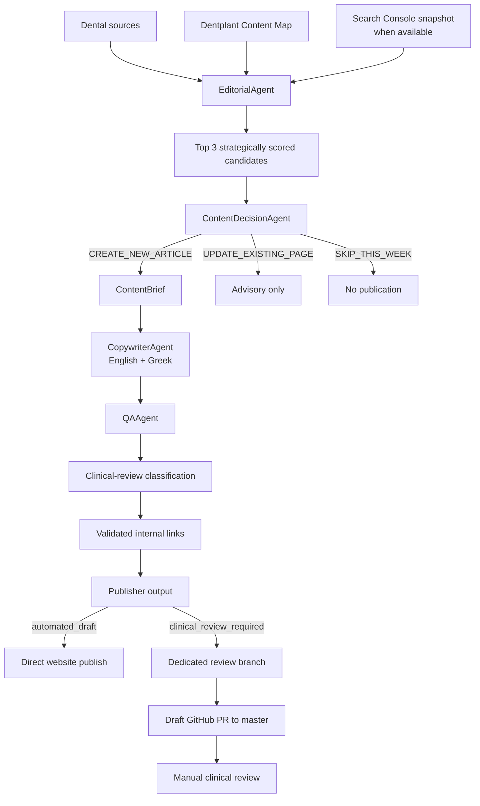

# 🦷 Dental Blog Bot 2.0

**Version 2.0.0** · Dentplant’s bilingual dental-content strategy system.

Dental Blog Bot 2.0 is not simply an article generator. It turns selected dental-source material, Dentplant’s site structure, measured search performance, and clinical safeguards into a deterministic weekly publication decision for the Dentplant website.

## What it does

The bot combines:

- dental-source ingestion and source-aware editorial scoring;
- the Dentplant content map and internal-link structure;
- optional Google Search Console performance signals;
- deterministic CREATE / UPDATE / SKIP weekly decisions;
- bilingual English/Greek generation from a structured `ContentBrief`;
- deterministic medical QA and validated internal-link insertion; and
- truthful clinical-review status and approval routing.

It does not force a publication when there is no meaningful opportunity, does not automatically rewrite an existing Dentplant page, and does not represent automated QA as clinician review.

## Weekly strategic decision model

Every run evaluates several candidates and returns one inspectable decision in `output/weekly_decision.json`.

### `CREATE_NEW_ARTICLE`

A candidate must clear editorial and Dentplant-strategy thresholds. The bot builds a `ContentBrief`, drafts bilingual content, runs QA, classifies clinical-review status, validates planned internal links, and prepares publisher output.

- `automated_draft` content may publish directly to the website’s `master` branch.
- `clinical_review_required` content is routed to a dedicated branch and a draft GitHub Pull Request for manual review.

### `UPDATE_EXISTING_PAGE`

This is an advisory-only recommendation when an existing mapped Dentplant page has a stronger optimization opportunity than a competing new article. No existing page is rewritten automatically.

### `SKIP_THIS_WEEK`

The bot can intentionally publish nothing. It generates no article and changes no website content.

## System architecture


```mermaid
flowchart TD
    S[Dental sources] --> E[EditorialAgent]
    M[Dentplant Content Map] --> E
    SC[Search Console snapshot<br/>when available] --> E
    E --> T[Top 3 strategically scored candidates]
    T --> D[ContentDecisionAgent]
    D -->|CREATE_NEW_ARTICLE| B[ContentBrief]
    D -->|UPDATE_EXISTING_PAGE| U[Advisory only]
    D -->|SKIP_THIS_WEEK| K[No publication]
    B --> C[CopywriterAgent<br/>English + Greek]
    C --> Q[QAAgent]
    Q --> R[Clinical-review classification]
    R --> L[Validated internal links]
    L --> P[Publisher output]
    P -->|automated_draft| DP[Direct website publish]
    P -->|clinical_review_required| BR[Dedicated review branch]
    BR --> PR[Draft GitHub PR to master]
    PR --> MR[Manual clinical review]
```

`UPDATE_EXISTING_PAGE` and `SKIP_THIS_WEEK` are non-publishing outcomes.

## Editorial strategy

`EditorialAgent` deduplicates source stories, applies editorial/clinical/source-quality checks, and adds Dentplant-specific strategy scores. These include:

- service relevance and cluster contribution;
- patient-intent fit;
- content-gap value;
- cannibalization risk;
- internal-link opportunity; and
- Search Console demand, CTR, ranking, trend, and existing-page opportunity when available.

The decision layer compares the top three strategically scored candidates. The editorially highest-ranked candidate does not automatically win: high overlap and a strong existing-page opportunity can favor `UPDATE_EXISTING_PAGE`, while weak or irrelevant candidates can still produce `SKIP_THIS_WEEK`.

## Search Console integration

`search_console.py` uses the Google Search Console API when it is configured and authorized.

- Configure the property with `SEARCH_CONSOLE_SITE_URL`, for example `https://www.dentplant.gr/`.
- Authentication uses Google Application Default Credentials (ADC), including `GOOGLE_APPLICATION_CREDENTIALS` where appropriate.
- The integration compares two complete, non-overlapping 28-day windows and excludes the current day.
- Query/page rows use clicks, impressions, CTR, and average position.

The deterministic opportunity model calculates bounded 0–10 signals for search demand, CTR opportunity, ranking opportunity, trend, and existing-page opportunity. Dentplant URL normalization removes query strings and fragments, recognizes home-page variants, and rejects unrelated hosts.

Search Console is an additional strategic signal, not a publication driver. If credentials, configuration, or API access are unavailable, the bot logs the unavailable signal and continues with a saved compact snapshot when available or neutral scores otherwise. It does not invent performance data.

## Dentplant content map

`data/dentplant_content_map.json` is a deterministic inventory of the Dentplant website. It records page paths, canonical URLs, titles/descriptions/headings, page types, internal and inbound links, relationship candidates, and sitemap membership.

Regenerate it without modifying the website checkout:

```bash
WEBSITE_PATH=/home/angelo/Gemini/dentplant-new python build_content_map.py
```

`build_content_map.py` validates the page inventory and produces stable output from the same checkout.

## ContentBrief

For `CREATE_NEW_ARTICLE`, `agents/content_brief.py` produces the structured plan consumed by the copywriter. It contains:

- source provenance and compact supported claims;
- evidence maturity;
- patient intent and target Dentplant cluster;
- related mapped pages;
- an approved bilingual internal-link plan;
- duplication-avoidance guidance;
- clinical-risk notes; and
- editorial constraints.

The copywriter uses this plan rather than independently selecting article strategy or inventing claims.

## Bilingual generation and QA

`CopywriterAgent` drafts English first and then Greek, using the same `ContentBrief`. `QAAgent` checks format integrity, bilingual content requirements, and the current 300–500 word target per language. When a model client is available, it also checks Greek clinical terminology and flow.

Deterministic ContentBrief-aware safeguards reject or flag:

- unsupported percentages or other statistics;
- guaranteed, zero-risk, lifetime-success, universally safe, or completely painless claims;
- association-to-causation inflation for oral-systemic evidence;
- early or emerging evidence presented as standard routine care;
- unsupported claims that Dentplant offers or routinely performs a technology/treatment;
- missing proportionate risk context where risk topics require it;
- diagnostic, candidacy, or examination-replacement wording; and
- link-plan targets or anchors that do not match the brief.

Automated QA is not clinical review.

## Clinical trust model

`agents/clinical_review.py` keeps generation, review recommendation, and completed review separate:

| Status | Meaning |
| --- | --- |
| `automated_draft` | Automated QA passed, no higher-risk trigger was found, and no human review is recorded. |
| `clinical_review_required` | Deterministic higher-risk triggers require clinical review before direct production publication. |
| `clinically_reviewed` | An explicit persisted manual clinical-review record exists. |

Automated QA, creation of a draft PR, and merging a PR cannot create `clinically_reviewed`. The explicit `mark_clinically_reviewed(...)` utility requires a permitted reviewer identity and review timestamp.

Approved naming is:

- English: `Dr. Angelo Moshopoulos`
- Greek: `κ. Άγγελος Μοσχόπουλος`

The system does not automatically use `Δρ. Άγγελος Μοσχόπουλος` in Greek and does not invent credentials or titles.

## Clinical-review approval gate

`approval_gate.py` turns review status into structured publication metadata.

### Low risk

`automated_draft` → `direct_publish` → normal website `master` publish.

### Review required

`clinical_review_required` → `clinical_review_pr` → deterministic branch such as:

```text
clinical-review/blog-YYYY-MM-DD-article-slug
```

The GitHub Actions workflow commits the prepared website changes to that branch and opens a draft PR targeting `master`. It does not force-push, auto-merge, or label the article clinically reviewed. Existing open PRs for the same branch are reused; a branch collision without an open matching PR fails closed. A branch-push or PR-creation failure never falls back to a direct `master` publish.

**Merge is the publication approval action, but merge alone does not update the compact clinical-review record to `clinically_reviewed`.** That remains an explicit manual action.

## Safe internal linking

`internal_links.py` renders links only from the `ContentBrief` plan.

- Every target must be a normalized Dentplant path present in the content map.
- Generated targets and bilingual anchors must exactly match the approved plan.
- External, arbitrary, malformed, traversing, or model-invented URLs are rejected.
- The renderer validates safe prose insertion, avoids nested anchors, and checks the final bilingual link set.
- Invalid plans fail closed before publishing.

Final article links use valid relative paths such as `../implants.html`.

## Project structure

```text
main.py                         Weekly runtime orchestration and structured result
generator.py                    Editorial evaluation, generation, and QA loop
publisher.py                    Bilingual HTML, SEO/template output, website data updates
approval_gate.py                Direct-publish versus clinical-review-PR handoff
search_console.py               Search Console retrieval, snapshot, normalization, scoring
internal_links.py               Fail-closed plan validation and link rendering
build_content_map.py            Deterministic Dentplant site inventory generator
version.py                      Product name and version
agents/
  editorial_agent.py            Editorial and Dentplant strategic scoring
  content_decision_agent.py     CREATE / UPDATE / SKIP decision engine
  content_brief.py              Structured article plan
  copywriter_agent.py           English/Greek ContentBrief-aware drafting
  qa_agent.py                   Format, medical-safety, and brief-compliance QA
  clinical_review.py            Review status, attribution, manual review utility
  memory.py / base.py           Lessons and shared model/runtime helpers
data/
  dentplant_content_map.json    Generated site inventory
output/                         Compact runtime records and local publication backups
.github/workflows/weekly_blog.yml  Monday production workflow
test_*.py                       Deterministic unit and integration-style tests
```

## Runtime artifacts

The runtime writes compact operational records when applicable:

- `output/weekly_decision.json`
- `output/weekly_content_brief.json`
- `output/weekly_clinical_review.json`
- `data/search_console_snapshot.json` when Search Console data is successfully captured

They are designed to exclude credentials, raw model prompts, raw provider responses, and full scraped source bodies.

## Configuration

Runtime environment variables:

| Variable | Purpose |
| --- | --- |
| `GOOGLE_API_KEY` | Gemini API key for model-backed editorial/copywriting/translation checks. |
| `GEMINI_MODEL` | Optional model override; defaults are handled by the runtime. |
| `WEBSITE_PATH` | Dentplant checkout root; defaults locally to `~/Gemini/dentplant-new`. |
| `OUTPUT_DIR` | Article output directory; defaults to `WEBSITE_PATH/article`. |
| `WEBSITE_DATA_PATH` | Posts JSON path; defaults to `WEBSITE_PATH/data/posts.json`. |
| `SEARCH_CONSOLE_SITE_URL` | Search Console property URL. |
| `GOOGLE_APPLICATION_CREDENTIALS` | Optional ADC service-account credential file location for Search Console environments. |

GitHub Actions secret:

| Secret | Purpose |
| --- | --- |
| `WEBSITE_PUSH_PAT` | Checks out/pushes the separate Dentplant repository and authenticates `gh` for draft PR creation. |

Do not commit `.env`, tokens, or credential files.

## Local setup

```bash
pip install -r requirements.txt
python main.py
```

The local dashboard remains available:

```bash
python main.py --dashboard
```

## GitHub Actions production workflow

`.github/workflows/weekly_blog.yml` runs at **07:00 UTC every Monday** (approximately 09:00 Greece time), and can also be dispatched manually. It checks out both the bot and `1123alberto/dentplant-new`, then handles website and bot repository changes separately.

| Runtime outcome | Website action |
| --- | --- |
| CREATE + `automated_draft` | Commit and push the website checkout to `master`. |
| CREATE + `clinical_review_required` | Commit/push a review branch and open/reuse a draft PR targeting `master`. |
| UPDATE | Persist advisory bot output; no website branch or commit. |
| SKIP | Persist decision output; no website branch or commit. |

## Testing

Run the full suite from the project root:

```bash
.venv/bin/pytest -q
```

Focused tests mock model, network, Search Console, and GitHub-facing operations where appropriate. The v2.0.0 release validation completed with 72 passing tests.

## Operational limitations

- `UPDATE_EXISTING_PAGE` is advisory; it does not rewrite an existing page automatically.
- Merging a clinical-review PR does not itself mark the review record `clinically_reviewed`.
- Search Console signals are available only when the property and credentials are configured and authorized.
- Exact approved-anchor insertion can fail closed instead of rewriting article prose.
- Automated QA is not a substitute for human clinical review.

## Release information

- Product: **Dental Blog Bot 2.0**
- Version: **2.0.0**
- Tag: `v2.0.0-blog-strategy`
